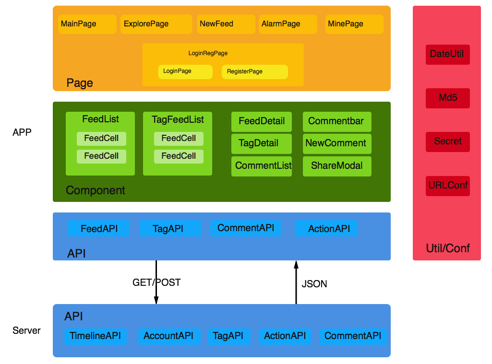
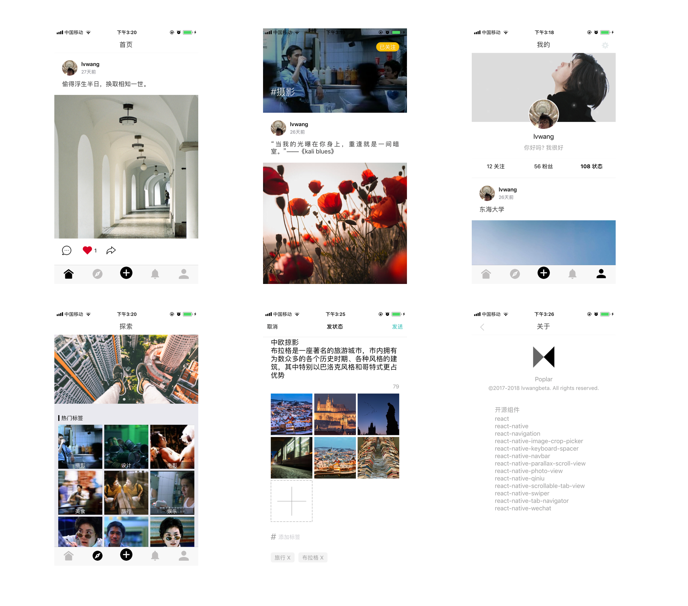
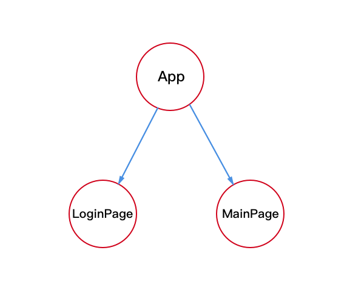
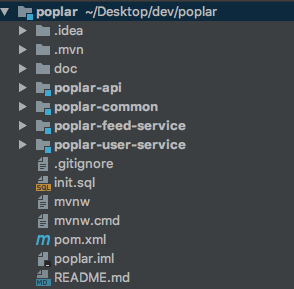
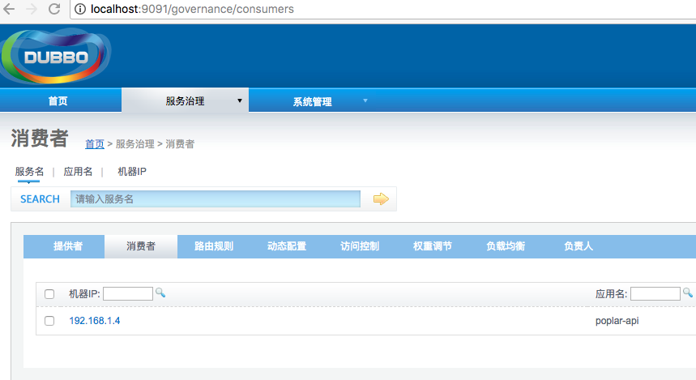

从React Native到微服务，落地一个全栈解决方案
====


Poplar是一个社交主题的内容社区，但自身并不做社区，旨在提供可快速二次开发的开源基础套件。前端基于React Native与Redux构建，后端由Spring Boot、Dubbo、Zookeeper组成微服务对外提供一致的API访问。

https://github.com/lvwangbeta/Poplar


# 前端React Native & Redux


React Native虽然提供跨平台解决方案，但并未在性能与开发效率上做出过度妥协，尤其是对于有JS与CSS基础的开发人员入手不会很难，不过JSX语法糖需要一定的适应时间，至于DOM结构与样式和JS处理写在一起是否喜欢就见仁见智了，可这也是一个强迫你去模块化解耦的比较好的方式。由于React组件的数据流是单向的，因此会引入一个很麻烦的问题，组件之间很难高效通信，尤其是两个层级很深的兄弟节点之间通信变得异常复杂，对上游所有父节点造成传递污染，维护成本极高。为此Poplar引入了Redux架构，统一管理应用状态。


## 模块化




APP由5个基础页面构成，分别是Feed信息流主页(MainPage)、探索发现页面(ExplorePage)、我的账户详情页(MinePage)、状态创建于发送页(NewFeed)、登录注册页面(LoginRegPage)等。页面又由基础组件组成，如Feed列表、Feed详情、评论、标签、相册等等。如果与服务器交互，则统一交由API层处理。



页面底部由`TabNavigator`包含5个`TabNavigator.Item`构成，分别对应基础页面，如果用户未登录，则在点击主页或新增Tab时呼出登录注册页面。


## Redux

引入Redux并不是赶潮流，而且早在2014年就已经提出了Flux的概念。使用Redux主要是不得不用了，Poplar组件结构并非特别复杂，但嵌套关系较多，而且需要同时支持登录与非登录情况的信息流访问，这就需要一个统一的状态管理器来协调组件之间的通信和状态更新，而Redux很好的解决了这个问题。

这里不枯燥的讲解Redux的架构模型了，而是以Poplar中的登录状态为例来简单说下Redux在Poplar项目中是如何使用的。

Poplar使用React-Redux库，一个将Redux架构在React的实现。

### 1. 场景描述

在未登录情况下，如果用户点击Feed流页面会弹出登录/注册页面，登录或注册成功之后页面收回，同时刷新出信息流内容。下图中的App组件是登录页面和信息流主页兄弟节点的共同父组件。



这个需求看似简单，但如果没有Redux，在React中实现起来会很蹩脚而且会冗余很多无用代码调用。


首先我们看下在没有Redux的情况下是如何实现这一业务流程的？

在点击Tabbar的第一个Item也就是信息流页签时，要做用户是否登录检查，这个检查可以通过查看应用是否本地化存储了token或其他验签方式验证，如果未登录，需要主动更新App组件的state状态，同时将这个状态修改通过props的方式传递给LoginPage，LoginPage得知有新的props传入后更新自己的state:{visible:true}来呼出自己，如果客户输入登录信息并且登录成功，则需要将LoginPage的state设置为{visible:false}来隐藏自己，同时回调App传给它的回调函数来告诉父附件用户已经登录成功，我们算一下这仅仅是两个组件之间的通信就要消耗1个props变量1个props回调函数和2个state更新，到这里只是完成了LoginPage通知App组件目前应用应该处于已登录状态，但是还没有刷新出用户的Feed流，因为此时MainPage还不知道用户已登录，需要App父组件来告知它已登录请刷新，可怎样通知呢？React是数据流单向的，要想让下层组件更新只能传递变化的props属性，这样就又多了一个props属性的开销，MainPage更新关联的state同时刷新自己获取Feed流，这才最终完成了一次登录后的MainPage信息展示。通过上面的分析可以看出Poplar在由未登录到登录的状态转变时冗余了很多但是又没法避免的参数传递，因为兄弟节点LoginPage与MainPage之间无法简单的完成通信告知彼此的状态，就需要App父组件这个桥梁来先向上再向下的传递消息。


再来看下引入Redux之后是如何完成这一同样的过程的：

还是在未登录情况下点击主页，此时Poplar由于Redux的引入已经为应用初始了全局登录状态{status: 'NOT_LOGGED_IN'}，当用户登录成功之后会将该状态更新为{status: 'LOGGED_IN'}，同时LoginPage与此状态进行了绑定，Redux会第一时间通知其更新组件自己的状态为{visible:false}。与此同时App也绑定了这个由Redux管理的全局状态，因此也同样可以获得{status: 'LOGGED_IN'}的通知，这样就可以很简单的在客户登录之后隐藏LoginPage显示MainPage，是不是很简单也很神奇，完全不用依赖参数的层层传递，组件想要获得哪个全局状态就与其关联就好，Redux会第一时间通知你。


### 2. 实现

以实际的代码为例来讲解下次场景的React-Redux实现：

#### connect

在App组件中，通过connect方法将UI组件生成Redux容器组件，可以理解为架起了UI组件与Redux沟通的桥梁，将store于组件关联在一起。

```javascript
import {showLoginPage, isLogin} from  './actions/loginAction';
import {showNewFeedPage} from './actions/NewFeedAction';

export default connect((state) => ({
  status: state.isLogin.status, //登录状态
  loginPageVisible: state.showLoginPage.loginPageVisible
}), (dispatch) => ({
  isLogin: () => dispatch(isLogin()),
  showLoginPage: () => dispatch(showLoginPage()),
  showNewFeedPage: () => dispatch(showNewFeedPage()),
}))(App)
```

connect方法的第一个参数是`mapStateToProps`函数，建立一个store中的数据到UI组件props对象的映射关系，只要store更新了就会调用`mapStateToProps`方法，`mapStateToProps`返回一个对象，是一个UI组件props与store数据的映射。上面代码中，`mapStateToProps`接收state作为参数，返回一个UI组件登陆状态与store中state的登陆状态的映射关系以及一个登陆页面是否显示的映射关系。这样App组件状态就与Redux的store关联上了。


第二个参数`mapDispatchToProps`函数允许将action作为props绑定到组件上，返回一个UI组件props与Redux action的映射关系，上面代码中App组件的`isLogin` `showLoginPage` `showNewFeedPage`props与Redux的action建立了映射关系。调用isLogin实际调用的是Redux中的`store.dispatch(isLogin)` action，dispatch完成对action到reducer的分发。


#### Provider

connect中的state是如何传递进去的呢？React-Redux 提供`Provider`组件，可以让容器组件拿到`state`

```javascript
import React, { Component } from 'react';
import { Provider } from 'react-redux';
import configureStore from './src/store/index';

const store = configureStore();

export default class Root extends Component {
  render() {
    return (
      <Provider store={store}>
        <Main />
      </Provider>
    )
  }
}
```

上面代码中，`Provider`在根组件外面包了一层，这样一来，`App`的所有子组件就默认都可以拿到`state`了。


#### Action & Reducer

组件与Redux全局状态的关联已经搞定了，可如何实现状态的流转呢？登录状态是如何扩散到整个应用的呢？

这里就需要Redux中的Action和Reducer了，Action负责接收UI组件的事件，Reducer负责响应Action，返回新的store，触发与store关联的UI组件更新。


```javascript
export default connect((state) => ({
  loginPageVisible: state.showLoginPage.loginPageVisible,
}), (dispatch) => ({
  isLogin: () => dispatch(isLogin()),
  showLoginPage: (flag) => dispatch(showLoginPage(flag)),
  showRegPage: (flag) => dispatch(showRegPage(flag)),
}))(LoginPage)

this.props.showLoginPage(false);
this.props.isLogin();
```

在这个登录场景中，如上代码，LoginPage将自己的props与store和action绑定，如果登录成功，调用`showLoginPage(false)`action来隐藏自身，Reducer收到这个dispatch过来的action更新store状态：

```javascript
//Action
export function showLoginPage(flag=true) {
  if(flag == true) {
    return {
      type: 'LOGIN_PAGE_VISIBLE'
    }
  } else {
    return {
      type: 'LOGIN_PAGE_INVISIBLE'
    }
  }
}

//Reducer
export function showLoginPage(state=pageState, action) {
  switch (action.type) {
    case 'LOGIN_PAGE_VISIBLE':
      return {
        ...state,
        loginPageVisible: true,
      }
      break;
    case 'LOGIN_PAGE_INVISIBLE':
      return {
        ...state,
        loginPageVisible: false,
      }
      break;
    default:
      return state;
  }
}
```

同时调用isLogin这个action更新应用的全局状态为已登录：

```javascript
//Action
export function isLogin() {
  return dispatch => {
      Secret.isLogin((result, token) => {
        if(result) {
          dispatch({
            type: 'LOGGED_IN',
          });
        } else {
          dispatch({
            type: 'NOT_LOGGED_IN',
          });
        }
      });
  }
}

//Reducer
export function isLogin(state=loginStatus, action) {
    switch (action.type) {
      case 'LOGGED_IN':
        return {
          ...state,
          status: 'LOGGED_IN',
        }
        break;
      case 'NOT_LOGGED_IN':
        return {
          ...state,
          status: 'NOT_LOGGED_IN',
        }
        break;
      default:
        return state;
    }
}
```


App组件由于已经关联了这个全局的登录状态，在reducer更新了此状态之后，App也会收到该更新，进而重新渲染自己，此时MainPage就会渲染出来了：

```javascript
const {status} = this.props;
return (
  <TabNavigator>
    <TabNavigator.Item
      selected={this.state.selectedTab === 'mainTab'}
      renderIcon={() => <Image style={styles.icon} 
                         source={require('./imgs/icons/home.png')} />}
      renderSelectedIcon={() => <Image style={styles.icon} 
                          source={require('./imgs/icons/home_selected.png')} />}
      onPress={() => {
                      this.setState({ selectedTab: 'mainTab' });
                      if(status == 'NOT_LOGGED_IN') {
                        showLoginPage();
                      }
                  }
               }
    >
	  //全局状态已由NOT_LOGGED_IN变为LOGGED_IN
      {status == 'NOT_LOGGED_IN'?<LoginPage {...this.props}/>:<MainPage {...this.props}/>}
```


后端微服务架构
=====


项目构建 & 开发
-----


### 1. 项目结构
  

poplar作为一个整体Maven项目，顶层不具备业务功能也不包含代码，对下层提供基础的pom依赖导入  
poplar-api有着两重身份：API网关接收渠道层请求路由转发、作为微服务消费者组织提供者服务调用完成服务串联  
poplar-user-service: 微服务提供者，提供注册、登录、用户管理等服务  
poplar-feed-service: 微服务提供者，提供feed创建、生成信息流等服务  
poplar-notice-service: 微服务提供者， 提供通知消息服务  

每个子项目以Module方式单独创建  


### 2. Maven聚合项目

Poplar由多个服务提供者、消费者和公共组件构成，他们之间的依赖关系既有关联关系又有父子从属关系，
为了简化配置也便于统一构建，需要建立合理的依赖。服务的提供者主要是Spring Boot项目，兼有数据库访问等依赖；服务的消费者同样是是Spring Boot项目，但由于是API层，需要对外提供接口，所以需要支持Controller；
服务消费者、提供者通过Dubbo完成调用，这也需要共用的Dubbo组件，所以我们可以发现消费者、提供者共同依赖Spring Boot以及Dubbo，抽离出一个parent的pom即可，定义公共的父组件：

```xml
<groupId>com.lvwangbeta</groupId>
<artifactId>poplar</artifactId>
<version>0.0.1-SNAPSHOT</version>
<packaging>pom</packaging>

<name>poplar</name>
<description>Poplar</description>
<dependencies>
    <dependency>
        <groupId>org.springframework.boot</groupId>
        <artifactId>spring-boot-starter-data-redis</artifactId>
    </dependency>
    <dependency>
        <groupId>org.springframework.boot</groupId>
        <artifactId>spring-boot-starter-jdbc</artifactId>
    </dependency>
    <dependency>
        <groupId>org.springframework.boot</groupId>
        <artifactId>spring-boot-starter-web</artifactId>
    </dependency>    
    ...
</dependencies>
```

Poplar父组件除了引入公共的构建包之外，还需要声明其包含的子组件，这样做的原因是在Poplar顶层构建的时候Maven可以在反应堆计算出各模块之间的依赖关系和构建顺序。我们引入服务提供者和消费者：

```xml
 <modules>
    <module>poplar-common</module>
    <module>poplar-api</module>
    <module>poplar-feed-service</module>
    <module>poplar-user-service</module>
</modules>
```
 子组件的pom结构就变的简单许多了，指定parent即可，pom源为父组件的相对路径

```xml
<groupId>com.lvwangbeta</groupId>
<artifactId>poplar-api</artifactId>
<version>0.0.1-SNAPSHOT</version>
<packaging>war</packaging>

<name>poplar-api</name>
<description>poplar api</description>

<parent>
    <groupId>com.lvwangbeta</groupId>
    <artifactId>poplar</artifactId>
    <version>0.0.1-SNAPSHOT</version>
    <relativePath>../pom.xml</relativePath> <!-- lookup parent from repository -->
</parent>   
```

 还有一个公共构建包我们并没有说，它主要包含了消费者、提供者共用的接口、model、Utils方法等，不需要依赖Spring也没有数据库访问的需求，这是一个被其他项目引用的公共组件，我们把它声明为一个package方式为jar的本地包即可，不需要依赖parent：

```xml
<groupId>com.lvwangbeta</groupId>
<artifactId>poplar-common</artifactId>
<version>0.0.1-SNAPSHOT</version>
<packaging>jar</packaging>
```
在项目整体打包的时候，Maven会计算出其他子项目依赖了这个本地jar包就会优先将其打入本地Maven库。
在Poplar项目根目录执行`mvn clean install`查看构建顺序，可以看到各子项目并不是按照我们在Poplar-pom中定义的那样顺序执行的，而是Maven反应堆计算各模块的先后依赖来执行构建，先构建公共依赖common包然后构建poplar，最后构建各消费者、提供者。

[INFO] Reactor Summary:   
[INFO]    
[INFO] poplar-common ...................................... SUCCESS [  3.341 s]   
[INFO] poplar ............................................. SUCCESS [  3.034 s]   
[INFO] poplar-api ......................................... SUCCESS [ 25.028 s]   
[INFO] poplar-feed-service ................................ SUCCESS [  6.451 s]   
[INFO] poplar-user-service ................................ SUCCESS [  8.056 s]   
[INFO] ------------------------------------------------------------------   

如果我们只修改了某几个子项目，并不需要全量构建，只需要用Maven的-pl选项指定项目同时-am构建其依赖的模块即可，我们尝试单独构建`poplar-api`这个项目，其依赖于`poplar-common`和`poplar`:

```shell
mvn clean install -pl poplar-api -am  
```

执行构建发现Maven将`poplar-api`依赖的`poplar-common`和`poplar`优先构建之后再构建自己：

[INFO] Reactor Summary:   
[INFO] 
[INFO] poplar-common ...................................... SUCCESS [  2.536 s]  
[INFO] poplar ............................................. SUCCESS [  1.756 s]   
[INFO] poplar-api ......................................... SUCCESS [ 28.101 s]    
[INFO] ------------------------------------------------------------------------    
[INFO] BUILD SUCCESS    

  


### 3. Dubbo & Zookeeper  
上面所述的服务提供者和消费者依托于Dubbo实现远程调用，但还需要一个注册中心，来完成服务提供者的注册、通知服务消费者的任务，Zookeeper就是一种注册中心的实现，poplar使用Zookeeper作为注册中心。  

#### 3.1 Zookeeper安装  

下载解压Zookeeper文件

```shell
$ cd zookeeper-3.4.6  
$ mkdir data  
```
创建配置文件 

```shell
$ vim conf/zoo.cfg

tickTime = 2000
dataDir = /path/to/zookeeper/data
clientPort = 2181
initLimit = 5
syncLimit = 2
```

启动

```shell
$ bin/zkServer.sh start
```

停止 

```shell
$ bin/zkServer.sh stop 
```

 

#### 3.2 Dubbo admin  
Dubbo管理控制台安装 

```shell
git clone https://github.com/apache/incubator-dubbo-ops
cd incubator-dubbo-ops && mvn package  
```

然后就可以在target目录下看到打包好的war包了，将其解压到tomcat `webapps/ROOT`目录下（ROOT目录内容要提前清空），可以查看下解压后的`dubbo.properties`文件，指定了注册中心Zookeeper的IP和端口  

```properties
dubbo.registry.address=zookeeper://127.0.0.1:2181
dubbo.admin.root.password=root
dubbo.admin.guest.password=guest
```

启动tomcat

```shell
./bin/startup.sh 	
```
访问 

```shell
http://127.0.0.1:8080/   
```
这样Dubbo就完成了对注册中心的监控设置  

 


###  4. 开发 
微服务的提供者和消费者开发模式与以往的单体架构应用虽有不同，但逻辑关系大同小异，只是引入了注册中心需要消费者和提供者配合实现一次请求，这就必然需要在两者之间协商接口和模型，保证调用的可用。  

文档以用户注册为例展示从渠道调用到服务提供者、消费者和公共模块发布的完整开发流程。

#### 4.1 公共  
poplar-common作为公共模块定义了消费者和提供者都依赖的接口和模型， 微服务发布时才可以被正常访问到  
定义用户服务接口  

```java
public interface UserService {
    String register(String username, String email, String password);
}
```


#### 4.2 服务提供者  

UserServiceImpl实现了poplar-common中定义的UserService接口

```java
@Service
public class UserServiceImpl implements UserService {

    @Autowired
    @Qualifier("userDao")
    private UserDAO userDao;

    public String register(String username, String email, String password){
        if(email == null || email.length() <= 0)
            return Property.ERROR_EMAIL_EMPTY;

        if(!ValidateEmail(email))
            return Property.ERROR_EMAIL_FORMAT;
        ...
    }
```

可以看到这就是单纯的Spring Boot `Service`写法，但是`@Service`注解一定要引入Dubbo包下的，才可以让Dubbo扫描到该Service完成向Zookeeper注册：

```properties
dubbo.scan.basePackages = com.lvwangbeta.poplar.user.service

dubbo.application.id=poplar-user-service
dubbo.application.name=poplar-user-service

dubbo.registry.address=zookeeper://127.0.0.1:2181

dubbo.protocol.id=dubbo
dubbo.protocol.name=dubbo
dubbo.protocol.port=9001
```


#### 4.3 服务消费者  

前面已经说过，poplar-api作为API网关的同时还是服务消费者，组织提供者调用关系，完成请求链路。  

API层使用`@Reference`注解来向注册中心请求服务，通过定义在poplar-common模块中的UserService接口实现与服务提供者RPC通信  

```java
@RestController
@RequestMapping("/user")
public class UserController {

    @Reference
    private UserService userService;

    @ResponseBody
    @RequestMapping("/register")
    public Message register(String username, String email, String password) {
        Message message = new Message();
        String errno = userService.register(username, email, password);
        message.setErrno(errno);
        return message;
    }
} 
```

`application.properties`配置


```properties
dubbo.scan.basePackages = com.lvwangbeta.poplar.api.controller

dubbo.application.id=poplar-api
dubbo.application.name=poplar-api

dubbo.registry.address=zookeeper://127.0.0.1:2181 
```

 

###  5.服务Docker化

如果以上步骤都已做完，一个完整的微服务架构基本已搭建完成，可以开始coding业务代码了，为什么还要再做Docker化改造？首先随着业务的复杂度增高，可能会引入新的微服务模块，在开发新模块的同时提供一个稳定的外围环境还是很有必要的，如果测试环境不理想，可以自己启动必要的docker容器，节省编译时间；另外减少环境迁移带来的程序运行稳定性问题，便于测试、部署，为持续集成提供更便捷、高效的部署方式。

在poplar根目录执行 `build.sh` 可实现poplar包含的所有微服务模块的Docker化和一键启动：

```shell
cd poplar && ./build.sh
```

如果你有耐心，可看下如下两个小章节，是如何实现的

#### 5.1 构建镜像

Poplar采用了将各微服务与数据库、注册中心单独Docker化的部署模式，其中`poplar-dubbo-admin`是dubbo管理控制台，`poplar-api` ` poplar-tag-service ` `poplar-action-service ` `poplar-feed-service` ` poplar-user-service`是具体的服务化业务层模块，`poplar-redis`  `poplar-mysql`提供缓存与持久化数据支持，`poplar-zookeeper`为Zookeeper注册中心

```shell
poplar-dubbo-admin
poplar-api
poplar-tag-service
poplar-action-service
poplar-feed-service
poplar-user-service
poplar-redis
poplar-mysql
poplar-zookeeper
```


`poplar-api` ` poplar-tag-service ` `poplar-action-service ` `poplar-feed-service` ` poplar-user-service`业务层模块可以在`pom.xml`中配置`docker-maven-plugin`插件构建，在configuration中指定工作目录、基础镜像等信息可省去Dockerfile：

```xml
<plugin>
    <groupId>com.spotify</groupId>
    <artifactId>docker-maven-plugin</artifactId>
    <version>1.0.0</version>
    <configuration>
        <imageName>lvwangbeta/poplar</imageName>
        <baseImage>java</baseImage>
        <maintainer>lvwangbeta lvwangbeta@163.com</maintainer>
        <workdir>/poplardir</workdir>
        <cmd>["java", "-version"]</cmd>
        <entryPoint>["java", "-jar", "${project.build.finalName}.jar"]</entryPoint>
        <skipDockerBuild>false</skipDockerBuild>
        <resources>
            <resource>
                <targetPath>/poplardir</targetPath>
                <directory>${project.build.directory}</directory>
                <include>${project.build.finalName}.jar</include>
            </resource>
        </resources>
    </configuration>
</plugin>
```

如果想让某个子项目不执行docker构建，可设置子项目pom.xml的`skipDockerBuild`为`true`，如`poplar-common`为公共依赖包，不需要单独打包成独立镜像:

```xml
<skipDockerBuild>true</skipDockerBuild>
```

在poplar项目根目录执行如下命令，完成整个项目的业务层构建：

```shell
mvn package -Pdocker  -Dmaven.test.skip=true docker:build
```

```
[INFO] Building image lvwangbeta/poplar-user-service
Step 1/6 : FROM java
 ---> d23bdf5b1b1b
Step 2/6 : MAINTAINER lvwangbeta lvwangbeta@163.com
 ---> Running in b7af524b49fb
 ---> 58796b8e728d
Removing intermediate container b7af524b49fb
Step 3/6 : WORKDIR /poplardir
 ---> e7b04b310ab4
Removing intermediate container 2206d7c78f6b
Step 4/6 : ADD /poplardir/poplar-user-service-2.0.0.jar /poplardir/
 ---> 254f7eca9e94
Step 5/6 : ENTRYPOINT java -jar poplar-user-service-2.0.0.jar
 ---> Running in f933f1f8f3b6
 ---> ce512833c792
Removing intermediate container f933f1f8f3b6
Step 6/6 : CMD java -version
 ---> Running in 31f52e7e31dd
 ---> f6587d37eb4d
Removing intermediate container 31f52e7e31dd
ProgressMessage{id=null, status=null, stream=null, error=null, progress=null, progressDetail=null}
Successfully built f6587d37eb4d
Successfully tagged lvwangbeta/poplar-user-service:latest
[INFO] Built lvwangbeta/poplar-user-service
[INFO] ------------------------------------------------------------------------
[INFO] BUILD SUCCESS
[INFO] ------------------------------------------------------------------------ 
```


#### 5.2  启动运行容器

由于poplar包含的容器过多，在此为其创建自定义网络`poplar-netwotk`

```shell
docker network create --subnet=172.18.0.0/16 poplar-network
```

运行以上构建的镜像的容器，同时为其分配同网段IP

启动Zookeeper注册中心

```shell
docker run --name poplar-zookeeper --restart always -d  --net poplar-network --ip 172.18.0.6  zookeeper 
```

启动MySQL

```shell
docker run --net poplar-network --ip 172.18.0.8  --name poplar-mysql -p 3307:3306 -e MYSQL_ROOT_PASSWORD=123456 -d  lvwangbeta/poplar-mysql

```

启动Redis

```shell
docker run --net poplar-network --ip 172.18.0.9 --name poplar-redis -p 6380:6379 -d redis
```

启动业务服务

```shell
docker run --net poplar-network --ip 172.18.0.2 --name=poplar-user-service -p 8082:8082 -t lvwangbeta/poplar-user-service

docker run --net poplar-network --ip 172.18.0.3 --name=poplar-feed-service -p 8083:8083 -t lvwangbeta/poplar-feed-service

docker run --net poplar-network --ip 172.18.0.4 --name=poplar-action-service -p 8084:8084 -t lvwangbeta/poplar-action-service

docker run --net poplar-network --ip 172.18.0.10 --name=poplar-api -p 8080:8080 -t lvwangbeta/poplar-api

```


至此，poplar项目的后端已完整的构建和启动，对外提供服务，客户端（无论是Web还是App）看到只有一个统一的API。


项目完整源码: https://github.com/lvwangbeta/Poplar


