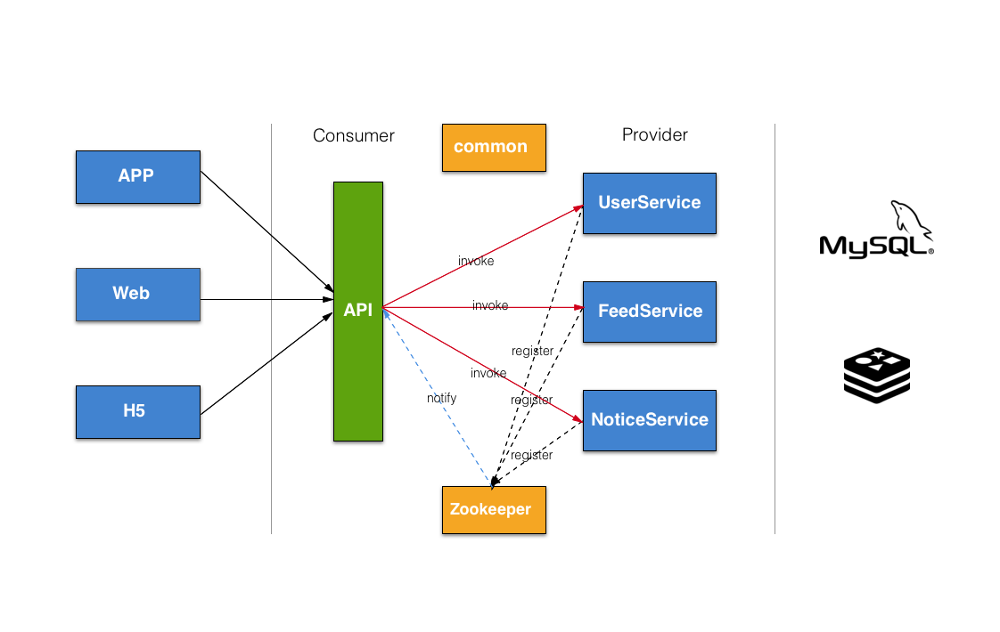
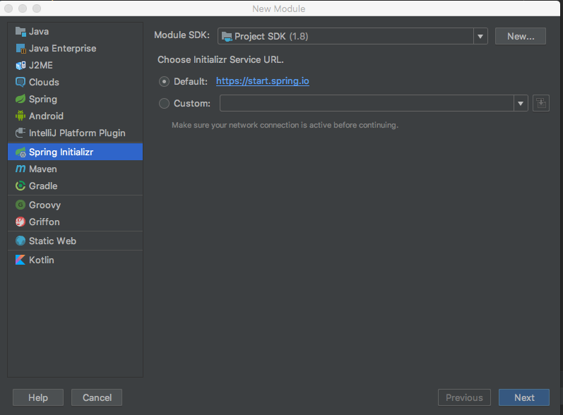
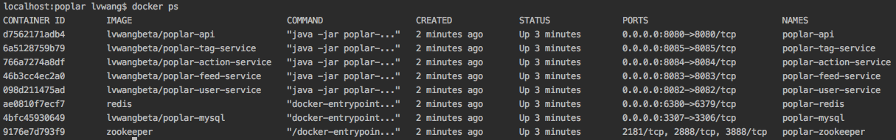

Poplar
====

微服务架构
=====



项目构建 & 开发
=====


### 1. 项目结构
  

poplar作为一个整体Maven项目，顶层不具备业务功能也不包含代码，对下层提供基础的pom依赖导入  
poplar-api有着两重身份：API网关接收渠道层请求路由转发、作为微服务消费者组织提供者服务调用完成服务串联  
poplar-user-service: 微服务提供者，提供注册、登录、用户管理等服务  
poplar-feed-service: 微服务提供者，提供feed创建、生成信息流等服务  
poplar-notice-service: 微服务提供者， 提供通知消息服务  

每个子项目以Module方式单独创建  



### 2. Maven聚合项目

Poplar由多个服务提供者、消费者和公共组件构成，他们之间的依赖关系既有关联关系又有父子从属关系，
为了简化配置也便于统一构建，需要建立合理的依赖。服务的提供者主要是Spring Boot项目，兼有数据库访问等依赖；
服务的消费者同样是是Spring Boot项目，但由于是API层，需要对外提供接口，所以需要支持Controller；
服务消费者、提供者通过Dubbo完成调用，这也需要共用的Dubbo组件，所以我们可以发现消费者、提供者共同依赖Spring Boot
以及Dubbo，抽离出一个parent的pom即可，定义公共的父组件：

```xml
<groupId>com.lvwangbeta</groupId>
<artifactId>poplar</artifactId>
<version>0.0.1-SNAPSHOT</version>
<packaging>pom</packaging>

<name>poplar</name>
<description>Poplar</description>
<dependencies>
    <dependency>
        <groupId>org.springframework.boot</groupId>
        <artifactId>spring-boot-starter-data-redis</artifactId>
    </dependency>
    <dependency>
        <groupId>org.springframework.boot</groupId>
        <artifactId>spring-boot-starter-jdbc</artifactId>
    </dependency>
    <dependency>
        <groupId>org.springframework.boot</groupId>
        <artifactId>spring-boot-starter-web</artifactId>
    </dependency>    
    ...
</dependencies>
```

Poplar父组件除了引入公共的构建包之外，还需要声明其包含的子组件，这样做的原因是在Poplar顶层构建的时候Maven可以在反应堆计算出各模块之间的依赖关系和构建顺序。我们引入服务提供者和消费者：

```xml
 <modules>
    <module>poplar-common</module>
    <module>poplar-api</module>
    <module>poplar-feed-service</module>
    <module>poplar-user-service</module>
</modules>
```
 子组件的pom结构就变的简单许多了，指定parent即可，pom源为父组件的相对路径

```xml
<groupId>com.lvwangbeta</groupId>
<artifactId>poplar-api</artifactId>
<version>0.0.1-SNAPSHOT</version>
<packaging>war</packaging>

<name>poplar-api</name>
<description>poplar api</description>

<parent>
    <groupId>com.lvwangbeta</groupId>
    <artifactId>poplar</artifactId>
    <version>0.0.1-SNAPSHOT</version>
    <relativePath>../pom.xml</relativePath> <!-- lookup parent from repository -->
</parent>   
```

 还有一个公共构建包我们并没有说，它主要包含了消费者、提供者共用的接口、model、Utils方法等，不需要依赖Spring也没有数据库访问的需求，这是一个被其他项目引用的公共组件，我们把它声明为一个package方式为jar的本地包即可，不需要依赖parent：

```xml
<groupId>com.lvwangbeta</groupId>
<artifactId>poplar-common</artifactId>
<version>0.0.1-SNAPSHOT</version>
<packaging>jar</packaging>
```
在项目整体打包的时候，Maven会计算出其他子项目依赖了这个本地jar包就会优先将其打入本地Maven库。
在Poplar项目根目录执行`mvn clean install`查看构建顺序，可以看到各子项目并不是按照我们在Poplar-pom中定义的那样顺序执行的，而是Maven反应堆计算各模块的先后依赖来执行构建，先构建公共依赖common包然后构建poplar，最后构建各消费者、提供者。

[INFO] Reactor Summary:   
[INFO]    
[INFO] poplar-common ...................................... SUCCESS [  3.341 s]   
[INFO] poplar ............................................. SUCCESS [  3.034 s]   
[INFO] poplar-api ......................................... SUCCESS [ 25.028 s]   
[INFO] poplar-feed-service ................................ SUCCESS [  6.451 s]   
[INFO] poplar-user-service ................................ SUCCESS [  8.056 s]   
[INFO] ------------------------------------------------------------------   

如果我们只修改了某几个子项目，并不需要全量构建，只需要用Maven的-pl选项指定项目同时-am构建其依赖的模块即可，我们尝试单独构建`poplar-api`这个项目，其依赖于`poplar-common`和`poplar`:

```shell
mvn clean install -pl poplar-api -am  
```

执行构建发现Maven将`poplar-api`依赖的`poplar-common`和`poplar`优先构建之后再构建自己：

[INFO] Reactor Summary:   
[INFO] 
[INFO] poplar-common ...................................... SUCCESS [  2.536 s]  
[INFO] poplar ............................................. SUCCESS [  1.756 s]   
[INFO] poplar-api ......................................... SUCCESS [ 28.101 s]    
[INFO] ------------------------------------------------------------------------    
[INFO] BUILD SUCCESS    

  


### 3. Dubbo & Zookeeper  
上面所述的服务提供者和消费者依托于Dubbo实现远程调用，但还需要一个注册中心，来完成服务提供者的注册、通知服务消费者的任务，Zookeeper就是一种注册中心的实现，poplar使用Zookeeper作为注册中心。  

#### 3.1 Zookeeper安装  

下载解压Zookeeper文件

```shell
$ cd zookeeper-3.4.6  
$ mkdir data  
```
创建配置文件 

```shell
$ vim conf/zoo.cfg

tickTime = 2000
dataDir = /path/to/zookeeper/data
clientPort = 2181
initLimit = 5
syncLimit = 2
```

启动

```shell
$ bin/zkServer.sh start
```

停止 

```shell
$ bin/zkServer.sh stop 
```

 

#### 3.2 Dubbo admin  
Dubbo管理控制台安装 

```shell
git clone https://github.com/apache/incubator-dubbo-ops
cd incubator-dubbo-ops && mvn package  
```

然后就可以在target目录下看到打包好的war包了，将其解压到tomcat `webapps/ROOT`目录下（ROOT目录内容要提前清空），可以查看下解压后的`dubbo.properties`文件，指定了注册中心Zookeeper的IP和端口  

```properties
dubbo.registry.address=zookeeper://127.0.0.1:2181
dubbo.admin.root.password=root
dubbo.admin.guest.password=guest
```

启动tomcat

```shell
./bin/startup.sh 	
```
访问 

```shell
http://127.0.0.1:8080/   
```
这样Dubbo就完成了对注册中心的监控设置  

 


###  4. 开发 
微服务的提供者和消费者开发模式与以往的单体架构应用虽有不同，但逻辑关系大同小异，只是引入了注册中心需要消费者和提供者配合实现一次请求，这就必然需要在两者之间协商接口和模型，保证调用的可用。  

文档以用户注册为例展示从渠道调用到服务提供者、消费者和公共模块发布的完整开发流程。

#### 4.1 公共  
poplar-common作为公共模块定义了消费者和提供者都依赖的接口和模型， 微服务发布时才可以被正常访问到  
定义用户服务接口  

```java
public interface UserService {
    String register(String username, String email, String password, String confirm );
}
```


#### 4.2 服务提供者  

UserServiceImpl实现了poplar-common中定义的UserService接口

```java
@Service
public class UserServiceImpl implements UserService {

    @Autowired
    @Qualifier("userDao")
    private UserDAO userDao;

    public String register(String username, String email, String password, String confirm ){
        if(email == null || email.length() <= 0)
            return Property.ERROR_EMAIL_EMPTY;

        if(!ValidateEmail(email))
            return Property.ERROR_EMAIL_FORMAT;
        ...
    }
```

可以看到这就是单纯的Spring Boot `Service`写法，但是`@Service`注解一定要引入Dubbo包下的，才可以让Dubbo扫描到该Service完成向Zookeeper注册：

```properties
dubbo.scan.basePackages = com.lvwangbeta.poplar.user.service

dubbo.application.id=poplar-user-service
dubbo.application.name=poplar-user-service

dubbo.registry.address=zookeeper://127.0.0.1:2181

dubbo.protocol.id=dubbo
dubbo.protocol.name=dubbo
dubbo.protocol.port=9001
```


#### 4.3 服务消费者  

前面已经说过，poplar-api作为API网关的同时还是服务消费者，组织提供者调用关系，完成请求链路。  

API层使用`@Reference`注解来向注册中心请求服务，通过定义在poplar-common模块中的UserService接口实现与服务提供者RPC通信  

```java
@RestController
@RequestMapping("/user")
public class UserController {

    @Reference
    private UserService userService;

    @ResponseBody
    @RequestMapping("/register")
    public Message register(String username, String email, String password, String confirm) {
        Message message = new Message();
        String errno = userService.register(username, email, password, confirm);
        message.setErrno(errno);
        return message;
    }
} 
```

`application.properties`配置


```properties
dubbo.scan.basePackages = com.lvwangbeta.poplar.api.controller

dubbo.application.id=poplar-api
dubbo.application.name=poplar-api

dubbo.registry.address=zookeeper://127.0.0.1:2181 
```

 


###  5.Docker容器化

打包镜像

```shell
mvn package -Pdocker  -Dmaven.test.skip=true docker:build
```

```
[INFO] Building image lvwangbeta/poplar-user-service
Step 1/6 : FROM java
 ---> d23bdf5b1b1b
Step 2/6 : MAINTAINER lvwangbeta lvwangbeta@163.com
 ---> Running in b7af524b49fb
 ---> 58796b8e728d
Removing intermediate container b7af524b49fb
Step 3/6 : WORKDIR /poplardir
 ---> e7b04b310ab4
Removing intermediate container 2206d7c78f6b
Step 4/6 : ADD /poplardir/poplar-user-service-2.0.0.jar /poplardir/
 ---> 254f7eca9e94
Step 5/6 : ENTRYPOINT java -jar poplar-user-service-2.0.0.jar
 ---> Running in f933f1f8f3b6
 ---> ce512833c792
Removing intermediate container f933f1f8f3b6
Step 6/6 : CMD java -version
 ---> Running in 31f52e7e31dd
 ---> f6587d37eb4d
Removing intermediate container 31f52e7e31dd
ProgressMessage{id=null, status=null, stream=null, error=null, progress=null, progressDetail=null}
Successfully built f6587d37eb4d
Successfully tagged lvwangbeta/poplar-user-service:latest
[INFO] Built lvwangbeta/poplar-user-service
[INFO] ------------------------------------------------------------------------
[INFO] BUILD SUCCESS
[INFO] ------------------------------------------------------------------------ 
```

运行镜像

```shell
docker run --net poplar-network --ip 172.18.0.2 --name=poplar-user-service -p 8082:8082 -t lvwangbeta/poplar-user-service

docker run --net poplar-network --ip 172.18.0.3 --name=poplar-feed-service -p 8083:8083 -t lvwangbeta/poplar-feed-service

docker run --net poplar-network --ip 172.18.0.4 --name=poplar-action-service -p 8084:8084 -t lvwangbeta/poplar-action-service

docker run --net poplar-network --ip 172.18.0.10 --name=poplar-api -p 8080:8080 -t lvwangbeta/poplar-api

```


启动Zookeeper注册中心

```shell
docker run --name poplar-zookeeper --restart always -d  --net poplar-network --ip 172.18.0.6  zookeeper 
```

启动MySQL

```shell
docker run --net poplar-network --ip 172.18.0.8  --name poplar-mysql -p 3307:3306 -e MYSQL_ROOT_PASSWORD=123456 -d  lvwangbeta/poplar-mysql

```

启动Redis

```shell
docker run --net poplar-network --ip 172.18.0.9 --name poplar-redis -p 6380:6379 -d redis
```


自定义容器网络

```
docker network create --subnet=172.18.0.0/16 poplar-network
```


