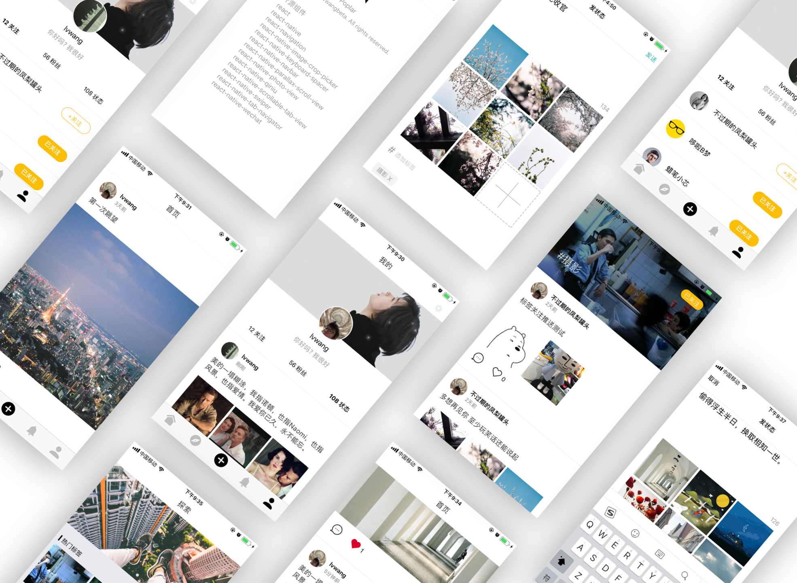
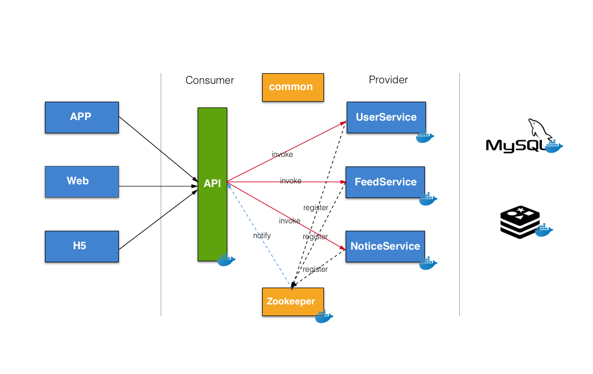

Poplar
=======

  

Poplar is a social networking application written by React Native, backend  is implemented based on microservice architecture. I choose MySQL and Redis as persistent and cache solution. The focus of Poplar is on social and interest, enables you to build a social theme application on Poplar quickly.


### 2.0 brings the following updates:

- More unified UI style

- Upgrade React from 15.3.2 to 16.0.0

- Upgrade React Native from 0.36.1 to 0.50.4

- Change to React Navigation

- Using react-redux manage application status

  

- Move Spring/Spring MVC 3.X to Spring Boot 1.5.13

- Micro service resolution


  


## Install Poplar

	git clone https://github.com/lvwangbeta/Poplar.git 
	cd Poplar/poplar-app && npm install
	react-native link
double click `ios/Poplar.xcodeproj` run it directly from `Xcode`


### App Configue 
edit `/App/api/URLConf.js` to configue backend server url and image server address.
	

Example：

* Application server 

   ```properties
   const APP_SERVER_HOST = 'http://127.0.0.1:8080';
   ```

   

* Image server address, upload and download images. Follow [qiniu-sdk](https://github.com/qiniu/react-native-sdk) to configue qiniu image storage.

   ```properties
   const IMG_BASE_URL = 'http://ogj1ador4.bkt.clouddn.com/'; 
   ```

   

### Server Configue 

> NOTE: Make sure you have installed Maven and Docker

```shell
cd Poplar && ./build.sh
```


## Introduction




## Dependencies

```
react-native-image-crop-picker
react-native-keyboard-spacer
react-native-navbar
react-native-parallax-scroll-view
react-native-photo-view
react-native-qiniu
react-native-scrollable-tab-view
react-native-swiper
react-native-tab-navigator
react-native-wechat
```


## License MIT


